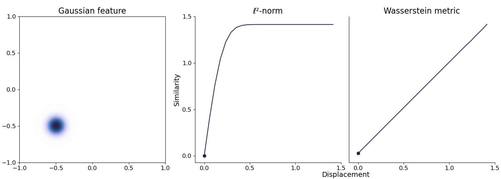

# L2 versus Wasserstein distance

The L2 distance is a commonly used metric in data science to compare similarity between distributions. However, if there is no spatial overlap between the features in the models being compared, then the L2 distance cannot differentiate between their similarity, even though the distributions in the models could be very different. The Wasserstein distance (or earth mover's distance) quantifies the amount of work needed to transform one distribution into another, at the cost of higher computational expense.

Check out the animation below. The L2 distance quickly saturates as the bulk of the two Gaussian blobs stop overlapping, while the Wasserstein distance increases at the same rate as their separation.

This is a simple toy example where the only change is that the two distributions increase in spatial separation. However, we could also imagine the width of the Gaussians increasing with distance (or changing into some other shape entirely). The L2 distance would have no idea this was happening, while the Wasserstein distance would be able to quantify the difference this makes to the distributions' similarity.
